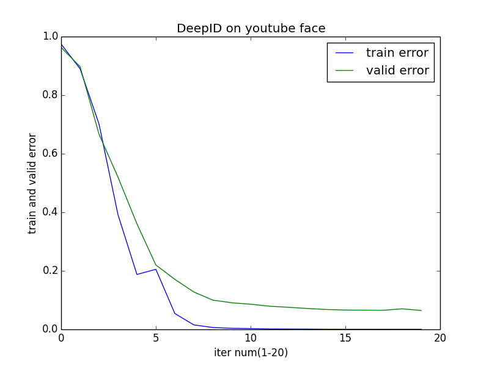

# FaceClassify

Implementation of DeepID using theano.

# Usage

## Environment

You have to install theano and related libs. There are enough information in the [theano document](http://deeplearning.net/software/theano/install.html#install). So i will assume all of the readers have installed theano correctly.

## Implemented Programmes

The structure of my code look like that:

<pre>
src/
├── conv_net
│   ├── deepid_class.py
│   ├── deepid_generate.py
│   ├── layers.py
│   ├── load_data.py
│   └── sample_optimization.py
└── data_prepare
    ├── vectorize_img.py
    ├── youtube_data_split.py
    └── youtube_img_crop.py
</pre>

Just as the names of the folders imply, there are two modules without reference to each other in my code. The `data_prepare` module is used to prepare data. And the `conv_net` module is the implemention of DeepID.


## Data Preparation

### Details

There are two parts which are important and neccessary for the amazing performance of DeepID, namely the net structure of the Convolutional Neural Network and the data. 

I had asked the author for the data, got nothing but a polite reply. So in my experiment, some other data are used instead.

Take the youtube face data as an example. There are three levels of folders, which is showed below:

<pre>
youtube_data/
├── people_folderA
│   ├── video_folderA
│   │   ├── img1.jpg
│   │   ├── img2.jpg
│   │   └── imgN.jpg
│   └── video_folderB
└── people_folderB
</pre>

The first thing need to be done is to seperate the data into train set and validate set. The way i choose train set and validate set is as below:

- Mix the imgs of the same person but different videos together.
- Random shuffle
- Choose first 5 imgs as validate set.
- Choose the 5<sup>th</sup> to 25<sup>th</sup> imgs as the train set.

At last, i get 7975 imgs as the validation set and 31900 imgs as the train set. Obviously, you will know that there are 1595 classes(persons) totally.

### Usage of Code

**Note** the file prefixed with "youtube" is specifically for the youtube data because of the folder structure and the img property. So if you want to deal with some other dataset, please read the code of `*_img_crop.py` and `*_data_split.py` and re-implement them. I believe the code is readable and easy to understand for the readers.

#### youtube_img_crop.py

Used to get the face out of the img. Face in youtube data has been aligned into the center of the img. So this programme aims to increase the ratio of the face in the whole img and resize the img into (47,55), which is the input size for the DeepID.

	Usage: python youtube_img_crop.py aligned_db_folder new_folder

- aligned_db_folder: source folder
- new_folder: The programme will generate the whole folder structure the same as the source folder, with all the imgs are processed into new size.

#### youtube_data_split.py

Used to split data into two set, One is for train and one is for valid. 

	Usage: python youtube_data_split.py src_folder test_set_file train_set_file

The format of test_set_file and train_set_file is like below. There are two parts in one line, the first is path of the img, the second is label of the img.

```
youtube_47_55/Alan_Ball/2/aligned_detect_2.405.jpg,0
youtube_47_55/Alan_Ball/2/aligned_detect_2.844.jpg,0
youtube_47_55/Xiang_Liu/5/aligned_detect_5.1352.jpg,1
youtube_47_55/Xiang_Liu/1/aligned_detect_1.482.jpg,1
```

#### vectorize_img.py

Used to vectorize the imgs. To make the thousands of imgs into a two-d array, whose size is (m,n). m is the number of samples, n is the 47×55×3.

To avoid occurance of super big file, `vectorize_img.py` automatically seperate data into batches with 1000 samples in each batch.

	Usage: python vectorize_img.py test_set_file train_set_file test_vector_folder train_vector_folder

- test_set_file: generated by *_data_split.py
- train_set_file: generated by *_data_split.py
- test_vector_folder: the folder name to store the vector files of validate set
- train_vector_folder: the folder name to store the vector files of train set


## Conv_Net

### Details

Now it's the exciting time. 

In the conv_net module, there are five programme files.

- layers.py: definition of different types of layer, including LogisticRegression, HiddenLayer, LeNetConvLayer, PoolLayer and LeNetConvPoolLayer.
- load_data.py: load data for the executive programme.
- sample_optimization.py: some test function to validate the corrective of layers defined in `layers.py`.
- deepid_class.py: DeepID main programme.
- deepid_generate.py: get the Hidden Layer used the trained parameters.

### Usage

#### deepid_class.py

	Usage: python deepid_class.py vec_valid vec_train params_file

- vec_valid: generated by `vectorize_img.py`
- vec_train: generated by `vectorize_img.py`
- params_file: to store the trained parameters of all iterations. It can be used if your computer come across unexpected shutdown. And it can be used to extract the hidden layer of the net.

**Note:** 
there are so many parameters need to be adjusted for DeepID, so i did not show them directly in the command line for the simple use of my code. If you want to change the epoch num, learning rate, batch size and so on, please change them in the last line of the file.


#### deepid_generate.py

***TODO***

# Performance

## DeepID performance

After running the `deepid_class.py`, you will get the output of the programme like that. The first part is the train error and valid error of each epoch, The second part is the summarization of the `epoch, train error, valid error`. 

```
epoch 15, train_score 0.000444, valid_score 0.066000
        epoch 16, minibatch_index 62/63, error 0.000000
epoch 16, train_score 0.000413, valid_score 0.065733
        epoch 17, minibatch_index 62/63, error 0.000000
epoch 17, train_score 0.000508, valid_score 0.065333
        epoch 18, minibatch_index 62/63, error 0.000000
epoch 18, train_score 0.000413, valid_score 0.070267
        epoch 19, minibatch_index 62/63, error 0.000000
epoch 19, train_score 0.000413, valid_score 0.064533

0 0.974349206349 0.962933333333
1 0.890095238095 0.897466666667
2 0.70126984127 0.666666666667
3 0.392031746032 0.520133333333
4 0.187619047619 0.360666666667
5 0.20526984127 0.22
6 0.054380952381 0.171066666667
7 0.0154920634921 0.128
8 0.00650793650794 0.100133333333
9 0.00377777777778 0.0909333333333
10 0.00292063492063 0.086
11 0.0015873015873 0.0792
12 0.00133333333333 0.0754666666667
13 0.00111111111111 0.0714666666667
14 0.000761904761905 0.068
15 0.000444444444444 0.066
16 0.000412698412698 0.0657333333333
17 0.000507936507937 0.0653333333333
18 0.000412698412698 0.0702666666667
19 0.000412698412698 0.0645333333333
```

You can also put the second part of the output into a figure with matplotlib.



## Generated Feature performance

***TODO***


# Reference

[1]. Sun Y, Wang X, Tang X. Deep learning face representation from predicting 10,000 classes[C]//Computer Vision and Pattern Recognition (CVPR), 2014 IEEE Conference on. IEEE, 2014: 1891-1898.

